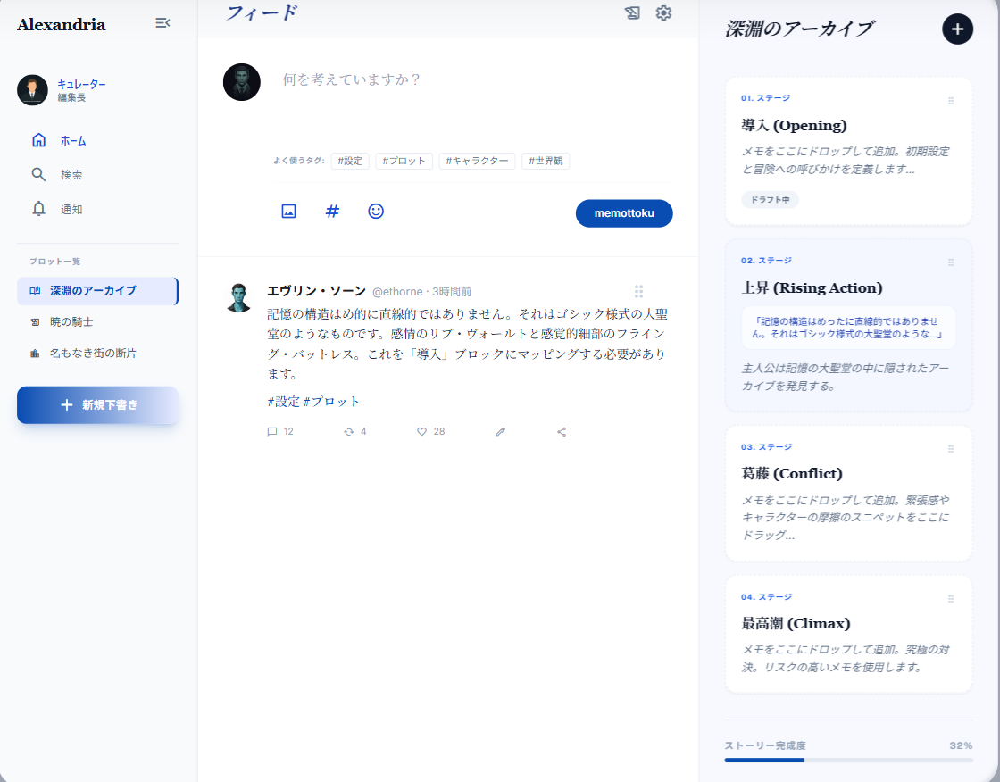

## アプリ名：メモットク

- 思いついたアイデアをSNS風メモにサッと気軽にメモして、シームレスにプロットを作成できるサービスです。創作する人が、楽しく自身のアイデアを形にすることをサポートするサービスです

## 2. このアイデアはどこから生まれたか

### 2-1. きっかけとなった体験・感情
---
私は世界観や物語、キャラクターの設定などを考えるのが好きなのですが、それを作品として完成させるのがとても苦手です

絵もマンガも途中まで作っては飽きて放り出すを繰り返しており、アイデアのほとんどは形にできずに投げ出してしまいます

そんな悩みを解決するため色々な創作アプリを試してきたのですが、高性能過ぎたりして使いこなせず
「アイデアはあるのに手を動かせない。何も完成させられないのが悔しい」

私は何年もこの悩みを抱えてきました

### 2-2. なぜそれが「気になった」のか
---

**なぜ自分はそれが気になったのだと思いますか？**

#### 自分の性格：
  めんどくさがりなのに、こだわりが強い

#### 過去の経験：
  書きたい物語や世界観はあるけれど、いざ書こうとすると気が散ってしまったり、完璧を目指してしすぎて、途中で投げ出してしまう。他の方が素晴らしい絵や漫画を作っている中で、自分はなにも完成できていないという虚しさや悔しさを抱えることが多々あります。
    この繰り返しの中で「完成させられない自分」をどうにかしたいという悩みが、他の人よりも強く心に引っかかるようになったのだと思います

#### 大切にしている価値観：
  私が好きな漫画を描いている方などを観察すると、一場面を切り取ったものなどを書いている方も多いことに気づき
「完璧にストーリーや世界観を固めなくてもいいんだ！」と気持ちが楽になった経験があります。
    この経験から「厳格に設定やシナリオを固めなくても、人の心を動かす物は作れる」と気づき、まずは形にしてみることが大切なのだと思うようになりました

## 3. 課題の整理（表面的になっていないか）

### 3-1. 表に見えている困りごと
---

その体験の中で、最初に感じた「困りごと」は何ですか？

描きたいアイデアを思うように形にできないことです

### 3-2. 本当に解決したい課題は何か
---

「なぜそれが困るのか？」を****最低3回****繰り返してください。

アイデアを形にできない。作ろうとしても、気がつけば、資料探しと銘打ってネットサーフィンをし、他の方の作品を見る側に回っている

これを何年も繰り返してきた結果
- ほかの方が完成させたクオリティの高い絵や漫画を、SNSなどですぐ見られる環境にある中、自分は何も完成させられない、自分の作品は拙いという劣等感
- もっと作品を完成させていれば、今頃もっと上手な絵や漫画が描けたはずなのにという後悔
- 思いついたものはいくつもあるのに、気がつけば何も形として残せていなかったという虚無感
- 何度も挫折を繰り返してしまう自分への苛立ち、自己嫌悪

などに繋がりました

**→ 本当に解決したい課題：作品を作れないことです**

ただし「作品を作れない」という課題の要因は幅広く、それらすべてを一度に解決しようとすると開発が破綻します。
なのでMVP地点で検証する課題は「**アイデアが断片的で、一つのストーリーとして形にできない**」という一点に絞ります

## 4. 想定ユーザーについて

### 4-1. 想定しているユーザー
---

#### ユーザー像：

- **創作スタイル**：
  - 楽しく創作したい、自分の好きなものを形にしたいタイプ
  - アイデアはあるけど、めんどくさかったり「ちゃんと形にしなきゃ」と気負ってしまったりして形にできない方
  - 他のガチすぎるツールでは気疲れしてしまう方
 
- **創作経験**：
  - 初心者〜中級者
  - 何作か書いた経験はあるが、途中で挫折することもある
  - アイデアはあるが、漫画や小説として形にした経験がない

- **現在の課題**：
- ツール以外の課題
  - アイデアはあるが、断片的で形にできない
  - アイデアをメモする前に忘れてしまう

- ツールの課題
  - 既存の創作アプリは多機能・本格的すぎて使いこなせない
    - 例：地図、時系列、キャラクタープロフィールなど、埋める項目がたくさんあり「こんな埋めないといけないのか...」と、尻込みしてしまう
  - 複数のアプリを使い分けるのが面倒
    - 情報が散らかると、どこにどの情報があるのか分からなくなってしまう　➡　結果、アイデアを忘れてしまうことにも繋がる

#### このアプリを使うことでどう解決できるか

- アイデアが断片的で形にできない
  → 断片的なアイデアを手軽にメモできることで、忘れずに済む。そして、それをそのままプロットへ変換、並べ替えができるため、ストーリーとして整理する最初の一歩を踏み出せる

- アイデアをメモする前に忘れてしまう
  → アプリを開いた瞬間にメモ画面が表示されるため、思いついた瞬間に最短の操作でアイデアを書き留められる

- 既存アプリが多機能すぎて尻込みしてしまう
  → プロットは自由記述。埋めなければいけない項目がないため、思い立ったらすぐにプロットとして組み立てられる

- 複数アプリで情報が散らかる
  → メモもプロットも1つのアプリに集約されるため「アイデアを探すのが面倒」「メモがどこかに行ってしまった」という悩みを解決

### 4-2. 自分とユーザーの距離
---
本アプリのターゲットユーザーは現在の自分自身です

#### → なぜその距離感なのか？
 私自身が現在 創作活動をしており、今まさにこの課題に苦しんでいるからです。
既存のアプリでは
- 手を動かしたとしても、仕上がりに満足いかなくて途中で投げ出してしまう
- 「そもそも手を動かすに至らない」

という、根本的な問題は解決しませんでした

自分自身が創作に悩んでおり、同じ悩みを抱えている方をターゲットユーザーにしているからこそ、ユーザーの目線に立ってアプリをアップデートしていけると思います

### 4-3. 実際に使われる可能性について(需要・存在確認)
---

- まず最初に使ってくれそうな人は誰か？
  - 小説やシナリオを書いている人
  - アイデアはあるけど、それをうまく組み立てられない人
  - 自分の作品を作りたいが、挫折してしまっている人
 
- その人は、どんな場面でこのアプリを思い出すか？
  - いいアイデアを思いついて、すぐにどこかにメモしたいとき
    - SNS風メモで手軽にメモできる
  - メモはメモアプリ、プロットはプロット管理アプリ...と行き来が面倒なとき
 
- 今の生活の中で、代わりに使っているものは何か？
  - メモアプリ（スマホのデフォルトのメモ、Notion、Memotter（SNS風メモ）など）
  - 創作アプリ（Nola、penCakeなど）
  - 紙

- それを置き換えてまで使う理由はあるか？
  あります

  - 複数のアプリを使い分けないといけないから面倒
  - 複数アプリに情報が散らばって管理しづらい
  - アプリを切り替える手間で集中力が途切れる
  - 既存の創作アプリのメモ機能は使いづらく、メモ専用アプリと使い分けざるを得なかった
  - 機能が煩雑過ぎる

  私は創作するにあたっていくつも創作アプリを試してきましたが、いずれのアプリにも上記のような不満点がありました。このアプリはこれらの不満を解消するために構想しました

  また、作品のクオリティを上げるためのプロット作成機能があっても「作品を完成させられない」という方向けのサポートがあるアプリは少なく、私は今後この点を解決し、楽しい創作をサポートできるような機能（AIによるプロット作成サポート、など）を実装する予定です

## 4-4. ユーザーがサービスを導入して利用するまでのイメージ(導入・継続の流れ)

- どんな場面・困りごとがきっかけで、このサービスを知る・思い出すか

  - 映画や漫画を見て、ふと思いついたアイデアをサッとメモしたい場面など
    1. アプリを開く（即メモ画面が表示される）
    2. SNS投稿感覚でアイデアをテキストに書き出す
    3. 書いたら完了。タイムラインにメモが積み上がっていく

  - メモしたアイデアをシナリオとして組み立てたいとき
    1. メモ一覧からプロット化したいメモにチェックを入れる
    2. 「プロットに追加」ボタンを押してメモをプロットのブロックに変換する
    3. プロット画面でブロックを並べ替え、ストーリーの流れを整理する

- 最初の一歩（登録・導入）で、ユーザーは何をする必要があるか
  - ユーザーは最初にアカウント登録を行う必要があり、「メールアドレス」「ニックネーム」「パスワード」が必要になります

- 利用を続ける理由は何か？（習慣・必要性・価値）
  - 習慣
    - アプリを開いた瞬間、即メモできる画面が表示されるため、「思いついたらここに書く」という行動が最短の操作で完結します。メモアプリは別途プロット作業が必要で、プロットアプリはメモUIが使いづらい。この2つの不満を同時に解消できるアプリは私が使った限りは他にないため、アイデアが浮かんだ瞬間、自然とこのアプリを開く選択肢になります
    - 思いついたアイデアを忘れず、メモがそのままプロットの材料になるため「書いたら終わり」ではなく「書くたびに作品が前進する」という実感が積み重なり、創作を続けるモチベーションに繋がります

- 必要性
  - メモアプリ（スマホのデフォルトのメモなど）ではプロットとして話を並べたりすることができません
 - かといって、他の創作ツールはメモとして使うには煩雑過ぎたり、ノイズが多すぎます

- 価値
  - アイデアをメモ→プロット化→作品完成という流れがスムーズになります
  - プロットを通して物語の枠組みが出来ていくと同時に「創作が進んでいる」という実感が得られます
  - 使い続けるほど自分のアイデアがアプリに蓄積されていき、見返したときに「自分にはこんなにアイデアがあった」というワクワク感が生まれます。それが筆をとるきっかけにもなり、そして少しずつでも形にしていくことで、自分の好きなものを作品として残せるようになります

## 5. 既存サービス・競合調査

### 5-1. 似たサービスの調査
---
メモアプリ
- サービス名：Memotter
  - URL
    - スマホアプリなのでURLはありません
  - どんなことができるか
    - X（Twitter）風のメモ。ハッシュタグを設定可能。メモはタイムライン上に表示される
  - 参考にした点
    - こんなUIだと気軽にアイデアをメモできていいな、と気づかせてくれたアプリです

- サービス名：MyLog
    - URL：
      - スマホアプリなのでURLはありません
    - どんなことができるのか：
      - こちらも上記のMemotterと似たようなX風メモ。最大の違いは**AIと話せる点**
    - 参考にした点：
      - こちらのアプリでは、SNSのリプライのようにAIから返信をもらうことができます。本リリースで実装予定のAIとの壁打ち機能を実装する際はこちらのアプリを参考にしたいと思います。こちらのAIは創作向けというよりは雑談向けなので、私のアプリでは指示を調整します

創作アプリ
 
- サービス名：ストーリープロッター
  - URL：
    - https://storyplotter.net/ja
  - どんなことができるか：
    - メモ、プロット作成、相関図、地図の作成、AIによる壁打ち、メモなど...
  - 参考にした点：
    - このアプリの元となったプロット制作アプリです。私はこちらのアプリで初めてプロットを作成したのですが、プロットがあると物語が組み立てやすくなり、感動した覚えがあります。
    メモとしては上記のMemotterのほうが使い勝手が良かったので、合体すればいいのでは？という発想に至りました
 
- サービス名：Notion
  - URL：
    - notion.com/ja
  - どんなことができるか：
    - オールインワン・ワークスペースアプリ。メモツールとしてカスタマイズ性があり自由度が高い他、AIによる文章の要約や、本文の修正など幅広く使える
  - 参考にした点：
    - メモだけでなく、様々な機能があり、一つのアプリで複数の操作を完結できる点が気に入っています。AIが内蔵されているため、指示を投げるだけで文章をマークダウンで綺麗にしてくれたり、創作の壁打ちとして使用出来たりしたため、ツール内にAIを内蔵する強さに気づきました
  
- サービス名：Nola
  - URL：
    - https://nola-novel.com/
  - どんなことができるか：
    - 小説執筆ツール。こちらもプロットやキャラクター管理などができるアプリです
 
- サービス名：Googleドキュメント
  - URL：
    - https://docs.google.com/
  - どんなことができるか
    - Googleのシンプルなテキストエディタ。Googleアカウントさえあればすぐ使える
  - 参考にした点：
    - こちらは卒業制作にあたって実施したアンケートで教えていただいたツールです。画面がシンプルで見やすい点が評価されており、当アプリでのプロット執筆画面も、このような煩雑さのないシンプルな画面を目指したいと思います

### 5-2. それでも自分が作りたい理由
---
今使っているアプリには下記のような不満点がありました

#### Memotter
  私が愛用していたメモアプリです。ハッシュタグ名を後から変更したかったのですが、そのタグのついたメモの数が膨大すぎて諦めたことがあります。その経験から私のアプリでは後からタグ名を後から変更できるようにしたいと思っています

#### ストーリープロッター
  私が愛用しているプロット作成アプリです。キャラクターや世界観で埋めなけばいけない項目が多く、使いこなせていません。また、スワイプすると意図せず画面が遷移し、文章が途中で消えてしまうなど操作面で不満があります。あとは複数端末でのデータ同期機能が月額課金である点です

#### Nola
  上記のストーリープロッターと同じように、多機能すぎて操作を覚えるのが大変、かつ、ハンバーガーメニューが多く、見えているボタンを押しても一度で目的の操作ができない点が私にとって致命的でした。もっと画面がシンプルなほうが私に合っていると思います。また、「保存する」ボタンを押さないと執筆状態が保存されないため、執筆中のデータが飛んでしまうこともありました

#### Notion
  ページが無限に階層化でき、自由度が高すぎるがゆえに、情報が散らばってどこに何を書いたか分からなくなってしまうことが多々あります。この点から、私のアプリでは最低限の画面の切り替え、クリックで目的の操作にたどり着けるようにしたいと思います

上記のような不満点、そしてなにより、これらのアプリでは私の悩みである「作品を作れないこと」を解決するものではありませんでした

自分の使いやすい創作アプリが欲しい。そして何より「作品を作れないこと」を解決できる創作アプリが欲しいと切実に思ったからです

### 5-3. 差別化ポイント
---
このアプリは、【どんな人】の【どんな瞬間】を一番助けるアプリですか？
私のアプリは楽しく創作したい人の、アイデアをメモしたい、それを形にしたい、と思った瞬間を助けるアプリです

- 私のアプリの差別化ポイント：

**既存アプリとの3つの設計上の違い**

#### ① メモからプロットへシームレスに繋がる設計：

既存アプリは「メモアプリ」か「プロットアプリ」のどちらかで、両方を兼ねるものはありませんでした。
このアプリはSNS風の吐き出しやすいメモと、プロット作成が1つのアプリで完結するため、アプリを切り替える手間なく、アイデアをプロットとして形にできます。断片的なアイデアをプロットとして並べていくことで、シーン同士に繋がりが生まれ、漠然としていたアイデアが具体的にストーリーの輪郭を持ち始めます

#### ② 義務感をなくす設計：

既存の創作アプリはテンプレート項目が多く、空白があると「埋めなければ」という義務感が生まれます。このアプリのプロットは自由記述のみのため、書きたいことだけ書いて前に進められます

#### ③ 集中を分断しない設計：

既存アプリはハンバーガーメニューが深く、目的の操作にたどり着くまでに気力が削がれます。このアプリはメニュー階層を極力なくし、機能を追加しても画面を煩雑にしないことを設計の原則とします

## 6. このサービスで提供したい価値

### 6-1. ユーザーの変化
---
このサービスを使うことで、ユーザーはどう変化しますか？

#### 行動の変化：
  - アイデアが浮かんだ瞬間にメモする習慣がつく
  - メモしたアイデアをプロットに変換する作業が日常的になる

#### 気持ちの変化：
  - すぐにアイデアをメモすることが出来ず忘れてしまい、悔しい思いをする → 「思いついたらすぐここにメモできる」という安心感
  - 「プロットを作るのが面倒」という気持ち → 「プロットを作るのが楽しい」という気持ち

#### 考え方の変化：
  - プロット作りはいろんな項目を埋めないといけないので難しい　→　項目に縛られず、シンプルなのでお手軽

### 6-2. 価値を一文で表す
---
このサービスは、断片的なアイデアを抱えながらも形にできずにいる創作者が、アイデアを物語として組み立て、作品を形にするのをサポートするサービスです

## 7. このアプリで実現すること

#### MVPで検証したいこと
「断片的なアイデアをプロットへ変換することで、アイデアに物語の輪郭を持たせられるか」という一点を検証します

メモの時点では、単なるアイデアに過ぎません。
しかし、それをプロットのブロックとして並べ、繋げていくことでシナリオとしての流れが生まれます。
「このシーンの前にはこんな展開が必要だ」という気づきが生まれ、漠然としていたアイデアが具体的な物語として見えてくる

私はこの体験こそが「作品を形にする」第一歩になると考えています。MVPではこの体験をシームレスに提供できるかを検証します

「完成させる」はMVPの範囲外です。書き始めた先の課題はAI壁打ちなど、本リリース以降の機能で段階的に解決していきます

### MVPで作る機能

- ユーザー登録・ログイン機能
- X風のメモ
- メモをプロットに変換できる機能
    - MVPリリース時点では、以下の操作を想定しています
  1. メモ一覧からプロット化したいメモにチェックを入れる
  2. 「プロットに追加」ボタンを押すとプロットブロックとして変換される。
本リリース以降では、より直感的な操作としてドラッグ＆ドロップによる変換を実装します。
（MVPでは技術的なリスクを避け、まず「変換できる」という価値を検証することを優先します）
- プロットを作成、編集できる機能
- プロットを一覧表示できる機能

### 本リリースで作る機能

- タグ機能、メモの検索機能
- 不要なボタンのオン/オフ機能
- メモのお気に入り機能
- コメントのようなツリー状のメモ
- 画像の添付機能
- アイデア壁打ちAIの実装
- 通知機能
- メモをプロットにまとめて追加する機能　など

## 8. このアプリの懸念点とその対策

このアプリが****うまくいかない可能性****と、

それに対して****どう向き合おうとしているか****を書いてください。

### 懸念点①
- 何が問題になりそうか：
  - 私の悩みである「創作を完成させる」ことを本格的に解決する機能を実装すると、MVPリリースが大幅に遅れることです

- なぜそう思うか：
  - 本来解決したい課題は「創作を完成させることができない」ことだが、そのための機能（通知機能、進捗管理、AI機能など）を最初から実装しようとすると、開発に時間がかかりすぎる
  - また、現在構想しているAI機能などは技術以外に利用料金などの問題もある
  - すべてを実装しようとすると、途中で挫折してしまう可能性が高い

- そのために考えている対策：
  - MVPでは、まず **「メモ→プロット変換」** という核となる機能に絞る
  - この機能だけでも「断片的なアイデアをプロットとして並べ、物語の輪郭を持たせられるか」という価値の検証ができるため、まずは動くものを作ることを優先する
  - 通知機能やAI機能は、MVPリリース後にユーザーの反応を見て、本当に必要かを確認してから段階的に追加する
  - **MVPを完成させる** ことを目標にし、まずは「動くアプリ」を作ることを最優先にする

### 懸念点②
  #### 何が問題になりそうか：
   - 現時点での構想では他のプロット作成アプリにはある資料管理できる機能がない点

  #### なぜそう思うか：
  - 卒業制作に取り掛かるに当たって、使っているツールの不満点のアンケートを取ったところ「設定、登場人物を管理する機能がなくて使うのをやめた」という意見があった
    - 実際私も登場人物や設定、資料を管理する機能は欲しい
    - しかし、これを実装すると、他の創作ツールにあったような「機能が多すぎて複雑化　➡　挫折」に至る可能性がある

  #### そのために考えている対策：
  - まずは **「メモからプロットへの変換」** という核となる機能を実装し、ユーザーに使ってもらう
    - ユーザーの反応を見て、資料管理機能が必要か、もしくはどのような形で実装するのかを判断する
    - タグ機能を追加することで、疑似的にメモを資料として使えるようにする（資料というタグをつけて絞り込める）

## 9. 今後の展開・発展の方向性

このアプリは、

- **「投稿して終わり」にならないために**
どんな広がりが考えられますか？

#### 観点：
- ユーザーはなぜ使い続ける？
  - 手軽なメモ×プロットアプリというツールは他にはない。ニッチではあるが、刺さったユーザーにとってはオンリーワン ＝ 使い続ける！

- 他の人と関わる余地はある？
   - なしにする予定です
    - 理由：他の方と自分の作品と比べ、落ち込んだり、焦ったりしてしまうことを避けたいからです
    - 自分のペースで、自分のアイデアと作品に没頭できるアプリにしたいと思っています

#### 今考えている発展案：
「創作物を形にできない。完成できない」という悩みを、より本格的に解決できるような機能を実装していきたいと思います。卒業制作に伴い、創作をしている方にアンケートを行ったので、頂いた意見を参考に以下の機能案があります

#### 機能追加の方向性：
  - 書きたいキャラクターなどはあるが、シナリオなどが思いつかない、という方向けの創作をサポートする機能（AI壁打ち機能など）
  - 登場人物や世界観などの資料を管理する機能
   -アプリが複雑化するかもしれないので慎重に考えたい
  - 起動したらすぐメモ画面が開くようにする
  - AIがプロットを整形してくれる機能

#### UI・体験の改善：
  - 140文字超のメモを折りたたみ表示（X風の「もっと見る」ボタン）
  - プロットやメモの文字数カウント機能
  - 必要のない機能の表示/非表示

#### 機能以外の工夫：
  - 日常的に使うものなので、画面遷移やクリック操作をできるだけ少なく目的の画面、操作にたどり着けるようにする
       - 例えばアイデアをメモする場合、まずは作品を選んで、資料画面を開いて、メモ画面を開いて...という一手間が挟まるだけでも、毎日何度も繰り返すとストレスになるため
  - ユーザーが操作できない待機時間を極力短くするように努める（起動時のロゴ表示などは行わない）

## 10. 技術スタック（手段としての技術）

### 10-1. 使用予定の技術
---

- バックエンド：Ruby on Rails8.1 
- フロントエンド：Rails + Hotwire（Turbo + Stimulus）
- DB：Neon
- デプロイ先：Render
- 使用予定ライブラリ：kaminari

以下はMVP後に実装予定の機能です

- 外部API：Gemini API

### 10-2. 技術選定の理由

#### なぜこの技術を使うのか
- Ruby on Rails8.1：

カリキュラムで習得済みのため、機能実装に集中できる。MVPに必要な認証・CRUD・DB連携が標準で揃っているためです

- Rails + Hotwire（Turbo + Stimulus）：
Renderとの連携が容易で、初期検証を低コストで開始できるためです

- Render ＋ Cloudinary：
画像のアップロードに使用。無料枠が25クレジットと類似サービスの中では一番大きかったため。サービスが本格化した場合、移行も検討しています

- kaminari：Turboと組み合わせて、Xのタイムライン風の無限スクロールを実装するために使用します

- Gemini API：
今後実装予定のAIとの壁打ちなどに使用する予定です。こちらもコストメリットが大きいため採用しようと思います

#### 不安な点と対策

- ドラッグ＆ドロップで異なるDB間でデータを変換する処理は行ったことがない点
  - 対策：MVPリリース時点ではドラッグ＆ドロップは実装せず、チェックボックス＋ボタン操作での変換に絞ります。
    まず「変換できる」という価値を検証した上で、本リリース以降にドラッグ＆ドロップへの移行を検討します

下記画像はstitchで作ったこのアプリのUIイメージです

### 画面遷移図 Figma：<https://www.figma.com/design/88ESsY0mj7oWQd8iFH8j29/%E3%83%A1%E3%83%A2%E3%83%83%E3%83%88%E3%82%AF%E3%80%80%E7%94%BB%E9%9D%A2%E9%81%B7%E7%A7%BB%E5%9B%B3?node-id=0-1&t=FG9lgBpe149TQHLW-1>